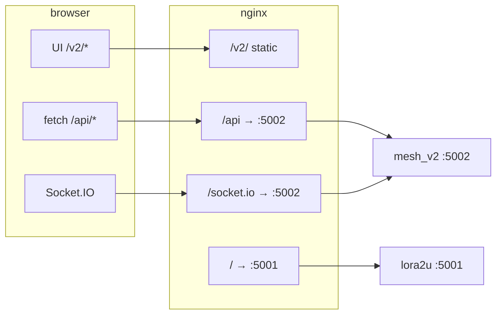

# Laporan deploy cloud & base URL (LoRa Mesh Pro v2)

Dokumen ringkasan kerja repo **mesh_pro_claude** dan setup di server **mahsites** supaya web v2 berjalan di **`https://lora2u.com/v2/`** selari dengan dev local.

**Kemas kini:** Mei 2026  
**Commit berkaitan:** `8bdd5a1` (SPA + chunk), `a8689ec` (port 5002 + `VITE_APP_BASE` / baseUrl)

---

## 1. Ringkasan matlamat

| Persekitaran | URL UI | API / Socket | Backend |
|--------------|--------|--------------|---------|
| **Dev (PC)** | `http://localhost:5173/v2/...` (ikut `VITE_APP_BASE`) | `http://localhost:5002/api` | Node port **5002** |
| **Production** | `https://lora2u.com/v2/` | Same-origin `https://lora2u.com/api` | PM2 **`mesh_v2`** port **5002** |
| **Legacy v1** | `https://lora2u.com/` | — | PM2 **`lora2u`** port **5001** |

Legacy v1 kekal di root `/`; mesh v2 (repo claude) di **`/v2/`** supaya kedua-dua boleh hidup serentak.

---

## 2. Kerja dalam repo

### 2.1 E5-c — Provisioning token

- Ganti `provisioning_nonce` → **token agensi** + `agency_token_expires_at`.
- API: `GET|POST|DELETE /api/agencies/:id/provision-token`.
- UI: `ProvisioningPanel`, QR (`qrcode`), superadmin + admin agensi.

Butiran: [`E5-c-provisioning-token-report.md`](./E5-c-provisioning-token-report.md), [`cursor-handoff-report.md`](./cursor-handoff-report.md).

### 2.2 Frontend — bundle & lazy load

| Fail | Perubahan |
|------|-----------|
| `frontend/vite.config.js` | `manualChunks` (map, calendar, qrcode, react, query, socket, utils, vendor) |
| `frontend/src/App.jsx` | `React.lazy` + `Suspense` |
| `frontend/src/lib/deviceTypeIcons.js` | Ikon Lucide named — elak `import *` (~600 kB) |

### 2.3 Backend — satu port: API + SPA statik

| Fail | Perubahan |
|------|-----------|
| `backend/public/` | Output Vite; `.gitkeep` bila kosong |
| `frontend/vite.config.js` | `outDir: ../backend/public`, `emptyOutDir: true` |
| `backend/server.js` | `express.static(public)` + SPA fallback (bukan `/api`); `trust proxy: 1` |
| `backend/package.json` | Skrip `build:ui` |

**Aliran deploy local production-like:**

```bash
cd frontend && npm run build    # atau: cd backend && npm run build:ui
cd backend && NODE_ENV=production npm start
```

### 2.4 API & Socket — same-origin vs dev

| Fail | Tingkah laku |
|------|--------------|
| `frontend/src/lib/api.js` | Production tanpa `VITE_API_URL` → base **`/api`** (origin semasa) |
| `frontend/src/lib/socket.js` | Production tanpa `VITE_SOCKET_URL` → Socket.IO same host |

Dev: `VITE_API_URL` / `VITE_SOCKET_URL` = **`http://localhost:5002`** — **tiada** `/v2` pada URL API.

### 2.5 Port dev diseragamkan → 5002

- Default `PORT` dalam `backend/config/env.js` dan `backend/.env.example`: **5002**.
- Elak clash dengan legacy **5001** di server (PM2 `lora2u`).

---

## 3. Base URL / path UI (`/v2/`)

### Masalah asal

- Production nginx serve UI di **`https://lora2u.com/v2/`**, tetapi kod pernah hardcode `/v2/` atau `base: '/'` — asset, router, redirect login tidak selari.
- `.env` salah (API dengan `/v2/` + port salah) → contoh error: `localhost:5002/v2//api/auth/login` (**ERR_CONNECTION_REFUSED**). API **bukan** di bawah `/v2`; hanya UI.

### Penyelesaian — satu rantaian config

```
frontend/.env          VITE_APP_BASE=/v2/
        ↓
frontend/appBase.js    normalizeAppBase(), DEFAULT_APP_BASE='/v2/'
        ↓
vite.config.js         base ← dari env
        ↓
import.meta.env.BASE_URL   (contoh '/v2/')
        ↓
frontend/src/lib/baseUrl.js
```

### Fail utama

| Fail | Peranan |
|------|---------|
| `frontend/appBase.js` | Normalisasi path (`/`, `/v2/`, slash hujung) |
| `frontend/vite.config.js` | `base` dari `VITE_APP_BASE` |
| `frontend/src/lib/baseUrl.js` | `BASE_URL`, `routerBasename`, `publicAsset()`, `loginPath()` |
| `frontend/src/App.jsx` | `BrowserRouter basename={routerBasename}` |
| `frontend/index.html` | Favicon `%BASE_URL%icon.ico` |
| `frontend/src/components/ui/AppLogo.jsx` | `publicAsset('logo.png')` |
| `frontend/src/pages/LoginPage.jsx` | Background `publicAsset('bg.webp')` |
| `frontend/src/lib/api.js` | Redirect 401 guna `loginPath()` |

### Peraturan

- **`VITE_APP_BASE`** → path UI sahaja (router, asset `public/`, favicon).
- **`VITE_API_URL` / `VITE_SOCKET_URL`** → origin backend sahaja, cth. `http://localhost:5002` — **jangan** `/v2/`.
- Tukar root vs `/v2/`: ubah `VITE_APP_BASE` dalam `frontend/.env`, **restart** `npm run dev`, **rebuild** + deploy `public` untuk server.

### Contoh `frontend/.env` (dev)

```env
VITE_APP_BASE=/v2/
VITE_API_URL=http://localhost:5002
VITE_SOCKET_URL=http://localhost:5002
```

### Contoh `frontend/.env.example` (production build)

```env
VITE_APP_BASE=/v2/
# Kosongkan untuk same-origin di lora2u.com:
# VITE_API_URL=
# VITE_SOCKET_URL=
```

---

## 4. Setup cloud (mahsites)

**Server:** mahsites (`178.128.48.114`)  
**Path app:** `/var/www/loramesh/mesh_v2/`  
**Domain:** `lora2u.com`, `www.lora2u.com`

Konfigurasi nginx **tidak** dalam repo; ia pada server.

### 4.1 Backend & PM2

| Item | Nilai |
|------|--------|
| `PORT` | **5002** |
| `NODE_ENV` | `production` |
| `API_BASE_URL` | `https://lora2u.com` |
| `DATABASE_URL` | MySQL `127.0.0.1`, DB `lora_mesh_pro` (selari legacy) |
| PM2 | Proses **`mesh_v2`** → `server.js` |
| Legacy | PM2 **`lora2u`** port **5001** (tidak diganti) |

**Sandaran server (contoh):** `/var/www/loramesh/backup/2026-05-23/`  
(`mesh_v2.env.bak`, `loramesh.conf.bak`, `.bak2`, dll.)

### 4.2 Nginx — `/etc/nginx/sites-available/loramesh.conf`

| Location | Fungsi |
|----------|--------|
| `/v2` | Redirect 301 → `/v2/` |
| `/v2/` | Static SPA — `alias` → `/var/www/loramesh/mesh_v2/public/` + SPA fallback |
| `/assets/` (asset Vite) | Fail dari `mesh_v2/public` (build dengan `base: '/v2/'`) |
| `/api/` | Proxy → `127.0.0.1:5002` |
| `/socket.io/` | WebSocket → **5002** |
| `/` | Legacy v1 → `127.0.0.1:5001` |
| `/simulator` | Tiada perubahan (legacy) |

Subdomain **`socketio.lora2u.com`** / **`websocket.lora2u.com`** → proxy ke **5002**.

Selepas edit: `nginx -t` → `systemctl reload nginx`.

### 4.3 Frontend di cloud

1. Build dengan `VITE_APP_BASE=/v2/` (sama `.env.example`).
2. Production: `VITE_API_URL` / `VITE_SOCKET_URL` kosong → browser guna `https://lora2u.com/api` dan Socket.IO same-origin.
3. Sync `backend/public/` (atau keseluruhan deploy tree) ke `/var/www/loramesh/mesh_v2/public/`.

### 4.4 Env production (MQTT & CORS) — `mesh_v2/.env`

| Pembolehubah | Nilai (production) |
|--------------|-------------------|
| `MQTT_PROTOCOL` | `wss` |
| `MQTT_HOST` | `mahsites.net` |
| `MQTT_PORT` | **8887** |
| `MQTT_WSS_HOST` | `mahsites.net` (jika digunakan) |
| `MQTT_WSS_PORT` | **8887** |
| `CORS_ORIGIN` | `https://lora2u.com`, `https://www.lora2u.com`, `http://localhost:5173` |

### 4.5 Schema & DB (Prisma) di cloud

DB production **`lora_mesh_pro`** wujud **sebelum** sejarah migration Prisma penuh — ada **drift**. Jangan guna `npx prisma migrate dev` on server. Corak rasmi repo (sama E5-c): **`db push`** → **`migrate resolve`** → **`generate`** → restart PM2.

**Lokasi:** jalankan dari `/var/www/loramesh/mesh_v2/backend` (atau `backend/` selepas `git pull`). Pastikan `DATABASE_URL` dalam `.env` production betul (MySQL `127.0.0.1`).

**Prisma CLI:** package `prisma` dalam `devDependencies`. Kalau deploy guna `npm ci --omit=dev`, CLI tiada — either `npm ci` penuh sekali untuk migrate, atau jalankan Prisma dari mesin dev dengan `DATABASE_URL` via SSH tunnel (jangan expose MySQL ke internet).

#### Aliran bila ada migration baru dalam repo

Setiap perubahan schema ada folder di `backend/prisma/migrations/<nama>/migration.sql` (contoh: `e5c_provisioning_token`, `drop_device_data_type`).

1. **Sandaran** (wajib jika `DROP COLUMN` / data loss):
   ```bash
   mkdir -p /var/www/loramesh/backup/$(date +%Y-%m-%d)
   mysqldump -uUSER -p lora_mesh_pro devices > /var/www/loramesh/backup/$(date +%Y-%m-%d)/devices_backup.sql
   # atau full DB untuk migration besar:
   # mysqldump -uUSER -p lora_mesh_pro > /var/www/loramesh/backup/$(date +%Y-%m-%d)/lora_mesh_pro_full.sql
   ```

2. **Kod & deps:**
   ```bash
   cd /var/www/loramesh/mesh_v2
   git pull
   cd backend
   npm ci
   ```

3. **Apply schema ke MySQL** (selarikan dengan `schema.prisma`):
   ```bash
   npx prisma db push --accept-data-loss
   ```
   Guna `--accept-data-loss` hanya bila Prisma amaran column/table akan gugur. Alternatif: jalankan SQL manual:
   ```bash
   mysql -uUSER -p lora_mesh_pro < prisma/migrations/<nama_folder>/migration.sql
   ```

4. **Rekod migration dalam `_prisma_migrations`** (satu folder sekali):
   ```bash
   npx prisma migrate resolve --applied <nama_folder>
   ```
   Contoh: `npx prisma migrate resolve --applied drop_device_data_type`

5. **Client + restart:**
   ```bash
   npx prisma generate
   pm2 restart mesh_v2 --update-env
   ```

6. **Verify:**
   ```bash
   curl -s https://lora2u.com/api/health/ping
   # optional: mysql -e "DESCRIBE devices;" lora_mesh_pro
   ```

#### Contoh ringkas — `drop_device_data_type` (`devices.data_type` dibuang)

Commit: `a6d0ec1` — selepas `git pull`, dari `backend/`:

```bash
mysqldump -uUSER -p lora_mesh_pro devices > ../backup/devices_pre_drop_data_type.sql
npx prisma db push --accept-data-loss
npx prisma migrate resolve --applied drop_device_data_type
npx prisma generate
pm2 restart mesh_v2 --update-env
```

#### Perintah — bila guna apa

| Perintah | Cloud (projek ini) |
|----------|-------------------|
| `migrate dev` | **Jangan** on production / DB drift |
| `db push` (+ `--accept-data-loss` bila perlu) | **Ya** — jadikan DB ikut `schema.prisma` |
| `migrate resolve --applied <folder>` | **Ya** — selepas push atau SQL manual |
| `migrate deploy` | Hanya jika `_prisma_migrations` 100% selari folder migrations; kalau drift, boleh gagal |
| `db:seed` / `npm run db:seed` | Jangan on prod kecuali sengaja |

Skrip npm (`backend/package.json`): `npm run db:push`, `npm run db:generate`, `npm run db:migrate:deploy` — sama CLI di atas.

**Deploy app vs deploy schema:** build frontend + sync `public/` **berasingan** dari langkah DB. Selepas schema berubah, **wajib** `prisma generate` + `pm2 restart mesh_v2` — kalau tidak, Prisma Client lama boleh crash (column tak wujud / mismatch).

Rujukan drift E5-c: [`E5-c-provisioning-token-report.md`](./E5-c-provisioning-token-report.md), [`cursor-handoff-report.md`](./cursor-handoff-report.md).

---

## 5. Aliran trafik (ringkas)



---

## 6. Checklist deploy semula

- [ ] Jika **`schema.prisma` / folder `prisma/migrations/` berubah:** ikut **§4.5** (backup → `db push` → `migrate resolve` → `generate`) **sebelum atau selepas** pull, kemudian `pm2 restart mesh_v2`
- [ ] `cd frontend && npm run build` → `backend/public/`
- [ ] Sync ke `/var/www/loramesh/mesh_v2/` (sekurang-kurangnya `public/`)
- [ ] `pm2 restart mesh_v2 --update-env` jika `.env` backend berubah (atau selepas migrate schema)
- [ ] Uji `https://lora2u.com/v2/` (200, asset `/v2/assets/...`)
- [ ] Uji `https://lora2u.com/api/health/ping`
- [ ] Uji login, peta, Socket.IO / tracking

---

## 7. Dev vs cloud — apa yang sama & berbeza

**Sama**

- `VITE_APP_BASE=/v2/` untuk UI di subpath production.
- Router & asset ikut `import.meta.env.BASE_URL` / `baseUrl.js`.
- Endpoint REST sentiasa **`/api`** (tanpa prefix `/v2`).

**Berbeza**

| Aspek | Dev | Cloud |
|-------|-----|-------|
| Server UI | Vite `:5173` | Nginx static `/v2/` |
| API URL | `VITE_API_URL=http://localhost:5002` | Same-origin (env kosong) |
| Backend listen | `:5002` local | `:5002` PM2 + nginx |
| Legacy `/` | Tidak dijalankan | `:5001` PM2 `lora2u` |

**Jangan**

- Campur `/v2/` ke `VITE_API_URL`.
- Jalankan frontend dev tanpa backend pada port yang sama seperti dalam `frontend/.env`.

---

## 8. Git & fail sensitif

| Item | Nota |
|------|------|
| Remote | `https://github.com/atiqihazizan/loramesh-claude.git` |
| `.env` / `backend/.env` | Tidak di-commit — ikut `.env.example` |
| `backend/public/*` | Di-ignore kecuali `.gitkeep` |

---

## 9. Indeks fail penting

**Frontend:** `appBase.js`, `vite.config.js`, `src/lib/baseUrl.js`, `src/lib/api.js`, `src/lib/socket.js`, `src/App.jsx`  
**Backend:** `server.js`, `config/env.js`, `config/cors.js`, `public/`, `prisma/schema.prisma`, `prisma/migrations/*/migration.sql`, `prisma.config.ts`  
**Dokumen:** `cursor-handoff-report.md`, `E5-c-provisioning-token-report.md`, **§4.5** (schema cloud)

---

*Laporan ini melengkapkan handoff Cursor; kemas kini selepas perubahan nginx, strategi base path, atau aliran migration DB cloud.*
