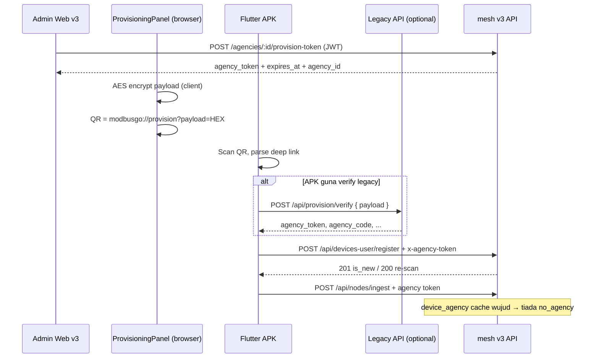

# Handoff Report — Device Self-Registration (v3) + Legacy QR Provisioning

**Repo:** `mesh_pro_claude` (backend + frontend v3)  
**Tarikh laporan:** 2026-05-24  
**Audiens:** Claude / pasukan APK Flutter / DevOps  
**Git commit backend register (committed):** `2ebb306` — `feat: device self-registration route (v3)`  
**Kerja QR legacy (frontend, belum commit):** `frontend/src/lib/provisioningQr.js`, `ProvisioningPanel.jsx`, `frontend/.env.example`

---

## 1. Ringkasan eksekutif

### Masalah asal
APK Flutter perlu **daftar device sendiri** dengan `agency_token` dari QR provisioning. Dalam v3, tanpa baris `device_agency`, `tracking-pipeline.js` langkah 3 menolak payload dengan `reason: 'no_agency'`.

### Penyelesaian backend (committed)
Route **`/api/devices-user/*`** + service `device-register-service.js` — cipta `devices`, `device_agency`, `device_log`, refresh cache, notifikasi `device_pending` bila device baru.

### Penyelesaian QR (uncommitted, frontend sahaja)
Admin v3 **tidak** port `/api/provision/verify` ke backend v3 (sengaja dibatalkan). Sebaliknya, **QR dijana di browser** dengan format legacy `modbusgo://provision?payload=<hex>` supaya APK lama boleh **imbas**. Pendaftaran peranti ke **mesh v3** melalui **`POST /api/devices-user/register`** dengan **`agency_token` mentah** (bukan URL QR).

### Kesilapan yang pernah dibuat (undone)
1. QR `modbusgo://<token>` — APK legacy tidak expect format ini.  
2. Backend penuh: `provisioning-crypto.js`, `routes/provision.js`, `deep_link` dalam API — bercanggah dengan keputusan “register hanya via devices-user”; **dibuang**, dikembalikan ke commit `2ebb306` untuk backend provisioning.

---

## 2. Arsitektur alur end-to-end



### Pemisahan tanggungjawab (penting)

| Komponen | Peranan |
|----------|---------|
| QR (frontend) | Format **legacy** untuk kamera / parser APK |
| `/api/provision/verify` | **Tiada di v3** — APK boleh panggil server legacy **jika** masih dikonfigurasi, atau APK decrypt/send verify ke host yang sama dengan key yang betul |
| `agency.agency_token` (DB v3) | Credential sebenar untuk register, ingest, Socket.IO |
| `/api/devices-user/register` | **Satu-satunya** endpoint v3 untuk self-registration device |

---

## 3. Backend v3 — Device self-registration

### 3.1 Fail

| Fail | Fungsi |
|------|--------|
| `backend/routes/devices-user.js` | HTTP routes |
| `backend/services/device-register-service.js` | `checkDevice`, `registerDevice` |
| `backend/routes/index.js` | `router.use('/devices-user', devicesUserRoutes)` |
| `backend/middleware/auth-agency-token.js` | Auth token agency untuk register / nodes |

**Tiada** `backend/routes/provision.js` dalam keadaan semasa (handoff).

### 3.2 `GET /api/devices-user/check/:deviceid`

- **Auth:** tiada (public)
- **Tujuan:** APK selepas reinstall — status device + snapshot `live_tracking`

**Response jika wujud:**

```json
{
  "exists": true,
  "device": {
    "device_id": "string",
    "name": "string",
    "need_approval": true,
    "date_approved": null,
    "agency": { "id": 2, "code": "RISDA001", "name": "..." },
    "last_known": {
      "latitude": 3.14,
      "longitude": 101.68,
      "speed": null,
      "heading": null,
      "status_live": "offline",
      "sensor_data": null,
      "updated_at": "..."
    }
  }
}
```

Jika tiada: `{ "exists": false, "device": null }`.  
`last_known` = `null` jika tiada baris `live_tracking`.

### 3.3 `POST /api/devices-user/register`

- **Auth:** `authenticateAgencyToken` — token **mentah** 48 hex char (bukan deep link)

**Header (prioriti):**

1. `x-agency-token: <agency_token>`
2. `Authorization: Bearer <agency_token>` atau raw token
3. Body `agency_token` / query `agency_token`

**Body:**

```json
{
  "device_id": "UUID-or-id",
  "name": "Nama peranti",
  "deviceid": "optional alias",
  "agency_id": "optional — DIABAIKAN jika tidak match token; token menang"
}
```

**Response 201 (device baru):**

```json
{
  "device": { "device_id", "name", "need_approval": true },
  "agency": { "id", "code", "name" },
  "is_new": true
}
```

**Response 200 (re-scan QR / register semula):** `is_new: false`, **`need_approval` tidak diubah**.

**Errors:** `400` validation, `401` token, `403` agency inactive.

### 3.4 Logik `registerDevice` (ringkas)

Dalam `prisma.$transaction`:

**Device baru:**

- `devices`: `need_approval: true`, `status: 'offline'`, `type_id` null
- `device_agency`: `active: true`
- `device_log`: `change_type: 'assignment'`, `change_reason: 'Self-registration via QR'`

**Device sedia ada (re-scan):**

- Jangan ubah `need_approval` / `date_approved`
- Kemas kini `name` jika berbeza
- Agency sama: pastikan `device_agency.active = true`
- Agency lain: deactivate lama, transfer, `device_log` `change_type: 'transfer'`

**Selepas transaction (luar TX):**

- `assignDeviceToAgencyInCache` / `unassignDeviceFromAgencyInCache`
- Jika `is_new`: `notifyDevicePending({ deviceId, deviceName, agencyId })` — gagal notifikasi **tidak** gagalkan register

### 3.5 Gate kelulusan admin

- Commit `874aec4`: `devices.need_approval`, `date_approved`
- Device self-register → `need_approval = true` sehingga admin sahkan (UI devices / settings)
- Tracking pipeline: semak sama ada approval block ingest — **verify dalam kod** jika APK perlu hantar data sebelum lulus; laporan asal prompt fokus `no_agency` selepas register

### 3.6 Notifikasi

- Commit `bee8bf2`: `notifyDevicePending` → superadmin + admin agency, `type: 'device_pending'`, link `/settings/devices`

### 3.7 Kenapa ingest gagal sebelum register

`tracking-pipeline.js` ~langkah route:

```text
getAgencyTokensByDeviceId(device_id) → kosong → { ok: false, reason: 'no_agency' }
```

Selepas register, `device-register-service` **mesti** panggil `assignDeviceToAgencyInCache(deviceId, agency_token)`.

**Gotcha cache agency:** `generateAgencyToken` dalam `provisioning-service.js` **tidak** panggil `refreshAgencyInCache` (keadaan commit `2ebb306`). Selepas admin **Generate token** provisioning, proses backend yang masih berjalan mungkin **401 Invalid agency token** sehingga **restart PM2** atau tambah `refreshAgencyInCache` (penambahbaikan opsional, belum dalam commit).

---

## 4. Admin web — Provisioning token (E5-c)

### 4.1 API (JWT, admin agency / superadmin)

| Method | Path | Keterangan |
|--------|------|------------|
| GET | `/api/agencies/:id/provision-token` | Status token |
| POST | `/api/agencies/:id/provision-token` | Jana token baru (409 jika masih valid) |
| DELETE | `/api/agencies/:id/provision-token` | Tamatkan token (`expires_at = now`) |

**GET response (contoh):**

```json
{
  "agency_id": 2,
  "agency_code": "RISDA001",
  "agency_name": "...",
  "agency_token": "48-char-hex-or-null-if-invalid",
  "agency_token_expires_at": "2026-05-25T...",
  "is_valid": true
}
```

Token = **`agency.agency_token`** dalam DB (bukan nonce berasingan). Tempoh default: `PROVISIONING_NONCE_TTL_MIN` (default 1440 minit).

### 4.2 UI

- `frontend/src/components/settings/ProvisioningPanel.jsx`
- Hook: `frontend/src/hooks/useAgencyToken.js`
- Halaman: `AgencySettingsPage`, `AgenciesPage` (modal)

---

## 5. QR legacy — frontend sahaja

### 5.1 Rujukan legacy (`lora2u_nodejs`)

Fail: `admin-frontend/js/agencies.js`

- API: `POST /api/agencies/:id/generate-provisioning-link`
- Backend bina encrypted hex, deep link:  
  `modbusgo://provision?payload=${encryptedPayload}`
- QR library: qrcodejs, 250×250, **CorrectLevel H**

Payload plaintext (JSON):

```json
{
  "agency_id": 2,
  "nonce": "<32 hex chars>",
  "expires_at": "<ISO8601>"
}
```

Enkripsi:

- Algoritma: **AES-256-CBC**
- Key: `PROVISION_ENCRYPTION_KEY` — padEnd(32).substring(0,32)
- Default key legacy: `default-32-char-encryption-key!!`
- Wire format: `hex( IV[16 bytes] || ciphertext )`

### 5.2 Implementasi v3 (browser)

Fail: **`frontend/src/lib/provisioningQr.js`**

- Web Crypto `AES-CBC`, format hex sama legacy
- `expires_at` = `status.agency_token_expires_at` dari API v3
- `agency_id` = `status.agency_id`
- `nonce` = SHA-256(`${agencyId}:${agencyToken}`).slice(0,32) — stabil per token (QR tidak flicker)
- Cache deep link per `(agencyId, token, expiresAt)`; clear on Generate/End

Env:

```env
VITE_PROVISION_ENCRYPTION_KEY=default-32-char-encryption-key!!
```

**Mesti selari** dengan `PROVISION_ENCRYPTION_KEY` di server yang jalankan **`POST /api/provision/verify`** jika APK masih guna verify.

### 5.3 Apa yang QR **bukan**

| Format | Status |
|--------|--------|
| Token mentah dalam QR | ❌ v3 awal (commit 2ebb306) — APK legacy sukar imbas |
| `modbusgo://<token>` | ❌ Dicuba, ditolak — bukan parser legacy |
| `modbusgo://provision?payload=…` | ✅ Format imbas legacy (frontend v3 sekarang) |

---

## 6. Legacy `/api/provision/verify` vs v3

Legacy (`lora2u_nodejs/routes/provision.js`):

- Input: `{ "payload": "<hex>" }`
- Decrypt → semak `expires_at` → load agency → return `agency_token`

**v3 tidak expose endpoint ini** (keputusan produk).

### Implikasi APK

**Opsyen A — APK kekal verify legacy**

- Base URL verify = host lora2u lama (atau proxy)
- DB agency **mesti** konsisten (unified DB) supaya `agency_id` dalam payload wujud
- Selepas verify → simpan `agency_token` → register ke **v3 base URL**

**Opsyen B — APK skip verify**

- Decrypt payload di app (kunci sama) **atau** terus guna token yang admin copy (tidak disyorkan production)
- Register terus v3 — **hanya** jika product benarkan bypass verify

**Opsyen C — Tambah verify di v3 (belum dilakukan)**

- Port `provision.js` — **ditolak** dalam sesi ini supaya tidak campur dengan `devices-user`

---

## 7. Skema DB relevan (Prisma v3)

| Model | Kunci / nota |
|-------|----------------|
| `agency` | `agency_token`, `agency_token_expires_at` |
| `devices` | `device_id` (string unique), `need_approval`, `date_approved` |
| `device_agency` | `(device_id int FK, agency_id)`, `active` |
| `device_log` | assignment / transfer |
| `live_tracking` | `device_id` string (devices.device_id) |
| `notifications` | `device_pending` |

Tiada migration baru khusus prompt register; migration tertunggak dari commit terdahulu mungkin perlu apply di cloud (`add_device_approval`, `add_notifications`) — rujuk `history-development/deployment-and-baseurl-report.md` §4.5.

---

## 8. Checklist QA

### Backend (committed)

- [ ] `npx prisma generate` OK
- [ ] `POST /api/devices-user/register` + token sah → 201, `need_approval=true`, `device_agency` active
- [ ] Re-scan → 200, `is_new=false`, approval kekal
- [ ] Ingest `/api/nodes/ingest` → bukan `no_agency`
- [ ] `GET /api/devices-user/check/:id` → `last_known` OK
- [ ] Token invalid → 401
- [ ] Device baru → notifikasi `device_pending`

### Frontend QR (uncommitted)

- [ ] `VITE_PROVISION_ENCRYPTION_KEY` set
- [ ] QR bermula dengan `modbusgo://provision?payload=`
- [ ] APK imbas berjaya
- [ ] Verify (jika digunakan) → dapat token
- [ ] Register v3 berjaya dengan token mentah

### Deploy

- [ ] `git pull`, `npm ci`, `pm2 restart mesh_v2`
- [ ] Restart selepas generate provisioning token (cache agency)

---

## 9. Commit & working tree (2026-05-24)

**Committed on `main` (local ahead origin by 1):**

```
2ebb306 feat: device self-registration route (v3)
bee8bf2 feat: in-app notification system
874aec4 feat: device approval gate
```

**Uncommitted / untracked (sesi QR + lain):**

```
M  frontend/.env.example
M  frontend/src/components/settings/ProvisioningPanel.jsx
M  frontend/src/lib/api.js
M  frontend/src/lib/baseUrl.js
M  frontend/src/lib/socket.js
M  history-development/deployment-and-baseurl-report.md
?? frontend/src/lib/provisioningQr.js
?? history-development/nginx-v1-v2-api-split.md
```

Pasukan Claude/APK patut anggap **QR legacy = working tree**, **register = commit 2ebb306**.

---

## 10. Prompt siap salin untuk Claude (APK / integrasi)

```text
Konteks mesh_pro_claude v3:

1. Self-registration: POST https://<v3-host>/api/devices-user/register
   Headers: x-agency-token: <48-char hex agency_token>
   Body: { "device_id": "...", "name": "..." }
   New device → 201, need_approval true. Re-scan → 200, is_new false.

2. Check after reinstall: GET /api/devices-user/check/:deviceid (no auth)

3. QR admin web: modbusgo://provision?payload=<AES-256-CBC hex>
   Built in browser (provisioningQr.js), NOT from v3 API.
   Plaintext JSON: { agency_id, nonce, expires_at }.
   Key: VITE_PROVISION_ENCRYPTION_KEY (default same as legacy).

4. v3 has NO /api/provision/verify. APK must either:
   - call legacy verify then register on v3, OR
   - be updated to obtain agency_token without verify, then register v3.

5. After register, tracking uses same agency_token on /api/nodes/ingest and Socket.IO.

6. Do NOT send modbusgo:// URL as agency token to register — only raw token.

Reference legacy: lora2u_nodejs admin-frontend/js/agencies.js generateProvisioningQRCode(deep_link).
Full report: history-development/device-provisioning-and-self-registration-handoff.md
```

---

## 11. Cadangan penambahbaikan (out of scope, belum implement)

1. `refreshAgencyInCache(agencyId)` selepas `generateAgencyToken` / `endAgencyToken` — elak 401 selepas generate tanpa restart.
2. Semak `agency_token_expires_at` dalam middleware agency-token (sekarang cache tidak semak expiry provisioning).
3. Commit frontend QR + dokumentasi env production.
4. Satu doc APK: base URL verify vs register vs ingest (lihat juga perubahan `baseUrl.js` / nginx split jika deploy `/v2/`).

---

*Dokumen ini disediakan untuk handoff; kemas kini tarikh/commit jika repo berubah.*
